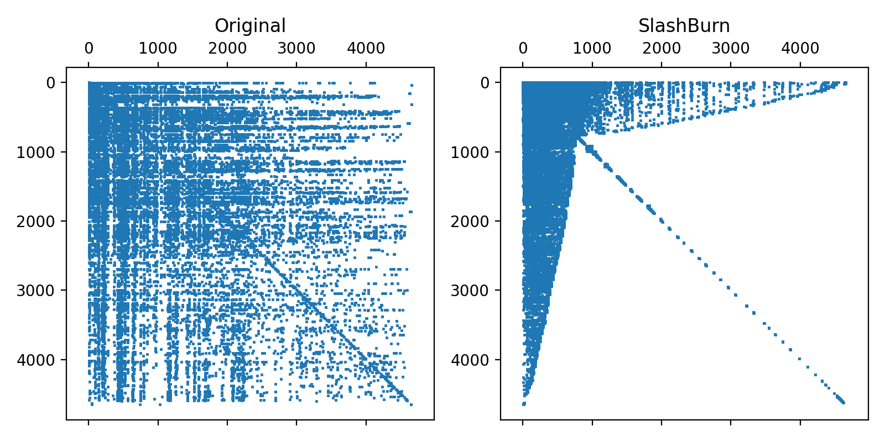

# parsb
A parallel implementation of the SlashBurn vertex ordering algorithm using OpenMP, ips4o sort, Afforest, and Spray Block Reductions

# Contents
1. [Running parsb in Docker](#running-parsb-in-docker)
2. [Running parsb Locally](#running-parsb-locally)
3. [parsb Parameters](#parsb-parameters)


# Running parsb in Docker
Use the [atrostan/parsb](https://hub.docker.com/repository/docker/atrostan/parsb/general) Docker image  to run parsb.  
The image is created using this [Dockerfile](./docker/Dockerfile).
## Requirements
| Name   | Version   |
| ------ | --------- |
| Docker | >= 24.0.6 |
| Python | >= 3.10   |


1. Create a virtual environment to run the docker container   
(Required packages are listed in `./docker/requirements.txt`)  
   ```bash
   python -m venv ./docker/venv
   source ./docker/venv/bin/activate
   pip install -r docker/requirements.txt
   ```

2. Build parsb in Docker container  
   The following will:  
     1. pull docker image from [atrostan/parsb](https://hub.docker.com/repository/docker/atrostan/parsb/general) (if not already pulled)
     2. (re)compile parsb using the input arguments
   (See [parsb Compile Time Parameters](#compile-time) for a description of parameters)
   ```bash
   python docker/build.py --block-width 32768
   ```

3. Run parsb  
   The following will run parsb on the given edgelist  

   (See [parsb Runtime Parameters](#runtime) for a description of input parameters)


   ```bash
   python docker/run.py \
      --graph-path "./data/graphs/librec-ciaodvd-trust.net" \
      --output-path "./data/graphs/librec-ciaodvd-trust.sb"  \
      -p 0.005 \
      --num-threads 8 \
      --plot-verify 
   ```
   If the input graph contains less than 10,000 vertices, you can verify the output of parsb by passing the optional `--plot-verify` flag.  
   This will plot the original graph and the SlashBurn adjacency matrices side-by-side, and save the plot in the same directory as the original edgelist.  
   e.g.,
   

# Running parsb Locally
Follow these instructions if you want to configure, build, and run parsb locally.

## Cloning

`git clone --recurse-submodules https://github.com/ubc-systopia/parsb.git`

## Requirements and Dependencies
parsb was developed and tested using Ubuntu clang version 17.0.0 and Ubuntu 22.04.3.

| Name   | Version   |
| ------ | --------- |
| CMake  | >= 3.16   |
| OpenMP | >= 5.1    |
| Ninja  | >= 1.10.1 |
| abseil | latest    |

## Compilation and Build

### Installing abseil
Intructions taken from https://abseil.io/docs/cpp/quickstart-cmake.html


```bash
$ cd <root directory for pasrb>

# clone
mkdir install && cd install
git clone https://github.com/abseil/abseil-cpp.git

# configure
cd abseil-cpp
mkdir build && cd build
cmake ..

# build
cmake --build . --target all
```

### Building Parallel SlashBurn

#### Configure
1. ensure submodules are installed  
   
   ```git submodule update --init --recursive```

```bash

export PARSB_ROOT_DIR=<root directory for parsb>
export BSIZE=1024
export BWIDTH=65536
export TIME=0

cmake \
    -DCMAKE_BUILD_TYPE:STRING=Release \
    -DCMAKE_C_COMPILER:STRING=/usr/bin/clang \
    -DCMAKE_CXX_COMPILER:STRING=/usr/bin/clang++ \
    -DBSIZE:STRING=${BSIZE} \
    -DBWIDTH:STRING=${BWIDTH} \
    -DTIME:STRING=${TIME} \
    -S${PARSB_ROOT_DIR} \
    -B${PARSB_ROOT_DIR}/build \
    -G Ninja

```

#### Build

```bash
cmake --build ${PARSB_ROOT_DIR}/build --config Release --target parsb --
```

### Running Parallel SlashBurn
```bash
./build/parsb \
    -f ./data/graphs/librec-ciaodvd-trust.net \
    -s \
    -o ./data/graphs/librec-ciaodvd-trust.sb \
    -p 0.005 \
    -t 8
```
parsb prints the following information per iteration:
- `i`: Iteration number
- `gcc`: Size of the Giant Connected Component (GCC)
- `avss`: Active Vertex Set Size - the number of vertices remaining in the graph
- `start`: offset into beginning of the permutation array 
- `end`: offset into end of the permutation array
- `n_cs`: number of spokes (connected components that are _not_ the GCC)

# parsb Parameters

## Compile Time

### `BSIZE`
Unused. Required by Spray compilation. Default = 1024. (Safe to Ignore)

### `BWIDTH`

Spray Hyperparameter.
Size of Spray `BlockReduction` - used in degree-decrement operation.  
_"`BlockReduction` privatizes the original locations lazily by dividing the array into statically sized blocks that are then privatized individually on demand."_  
Default: 65536,
Recommended: 
experiment by setting to few multiples of size of L2 cache.  

### `TIME`
True or False; Default: False.  
If True, time the execution of each subroutine in every iteration of parsb, namely:  
Degree sort, Afforest, Spoke-Sizing, Spoke-Sorting, and Degree-Decrement.


## Runtime

### `-f, --graph-path`
Path to input edgelist.   
**Important**  
 parsb assumes the input edgelist meets the following requirement:  
 - Given a graph with $n$ vertices, vertex IDs are in the range $[0, n)$  
 You can use the `compress` utility from [rhubarb](https://github.com/ubc-systopia/rhubarb) to ensure your input graph meets this requirement.
### `-s, `
Required. Symmetrize the input graph.
### `-o, --output-path`
Writes the SlashBurn vertex ordering to this path. 
The vertex ordering will be written using the following format:
```
<number of vertices in the graph>
<number of edges in the graph>
0 <vertex 0's new vertex ID>
1 <vertex 1's new vertex ID>
.
.
.
n - 1 <vertex n-1's new vertex ID>
```
### `-p, --percent`
SlashBurn removes $k$ hubs per iteration from the graph,  
Where $k = pn$, $p=$`percent`, and $n$ is the number of vertices in the graph.
### `-t, --num-threads`
How many threads to use for parsb.  
The number of threads in all `omp` parallel regions are set using this parameter.  
e.g. 
```c++
#omp parallel num_threads(num_threads)
{
   ...
}
```

# Structure
This repository contains the following folders and files:

- `build/` - CMake build directory
- `data/graphs` - Contains sample data
  - `librec-ciaodvd-trust.net` - a sample directed graph: [`librec-ciaodvd-trust`](http://konect.cc/networks/librec-ciaodvd-trust/) from [Konect](http://konect.cc/)
  - `librec-ciaodvd-trust.net.plot.png` - plot of original and SlashBurn adjacency matrices
  - `librec-ciaodvd-trust.net.sb` - SlashBurn ordering
- `docker/` - Dockerfile, python requirements, and scripts for running parsb in Docker
- `include/` - C++ headers (adapted from [gapbs]([gapbs](https://github.com/sbeamer/gapbs)))
- `install/` - Installation directory for [abseil](https://abseil.io/)
- `ips4o/` - ips4o submodule
- `src/` - `SlashBurn` class implementation
- `CMakeLists.txt` 
- `main.cpp` 

# References

1. Axtmann, M., Witt, S., Ferizovic, D. and Sanders, P., 2017. In-place Parallel Super Scalar Samplesort (IPS $^ 4$ o). arXiv preprint arXiv:1705.02257.
2. Beamer, S., Asanović, K. and Patterson, D., 2015. The GAP benchmark suite. arXiv preprint arXiv:1508.03619.
3. Hückelheim, J. and Doerfert, J., 2021, May. Spray: Sparse reductions of arrays in OpenMP. In 2021 IEEE International Parallel and Distributed Processing Symposium (IPDPS) (pp. 475-484). IEEE.
4. Lim, Y., Kang, U. and Faloutsos, C., 2014. Slashburn: Graph compression and mining beyond caveman communities. IEEE Transactions on Knowledge and Data Engineering, 26(12), pp.3077-3089.
5. Sutton, M., Ben-Nun, T. and Barak, A., 2018, May. Optimizing parallel graph connectivity computation via subgraph sampling. In 2018 IEEE International Parallel and Distributed Processing Symposium (IPDPS) (pp. 12-21). IEEE.


# Gotchas
1. ensure that Spray `block-width` does not exceed the number of vertices in the graph.   
i.e. Don't use a `block-width` of 65,536 on a graph with 100 vertices.
